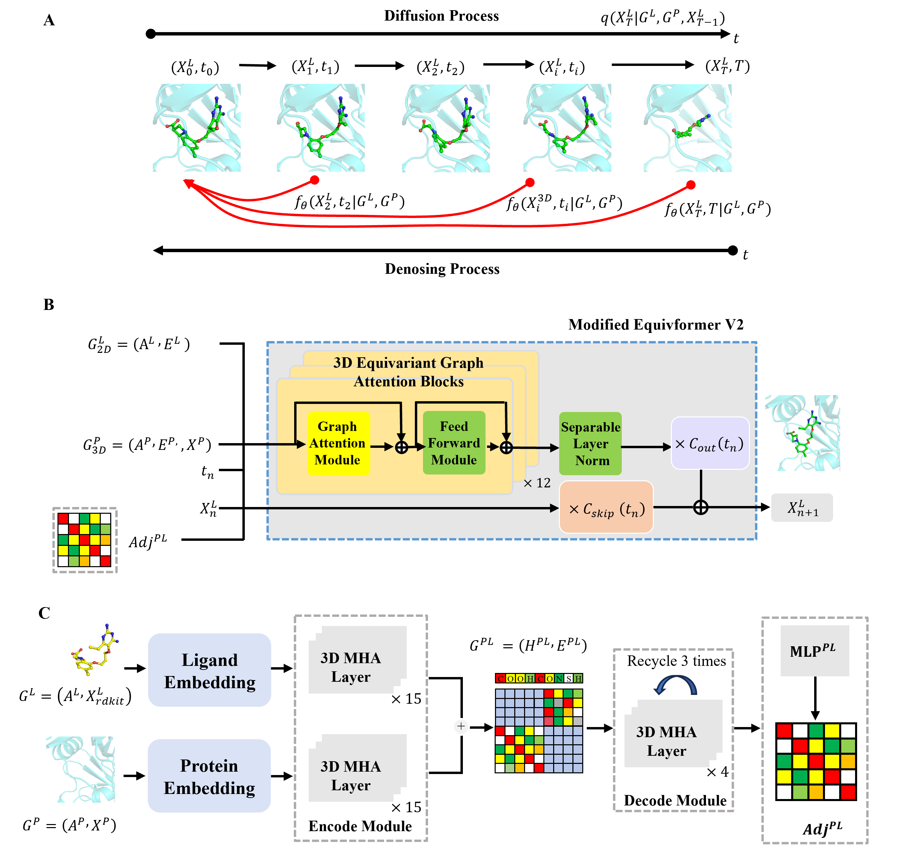

<h1 align="center">
   EC-Dock
</h1>

<h4 align="center">EC-Dock: A Fast Equivariant Consistency Model for Molecular Docking and Virtual Screening</h4>


<h2 align="center">
  
</h2>


## Dependencies
- Compatible with PyTorch 2.x , Python 3.12, tensorflow can be a cpu or gpu version.
- scikit_learn and scipy version need to be compatible with tf_geometric==0.1.0, so firstly install tf_geometric
- Dependencies can be installed using `requirements.txt`.

## Dataset:
### Training dataset:
-The data preprocessed by EquiBind group on [zenodo](https://zenodo.org/record/6408497) is no longer available due to PDBBind license.
If you want to train one of our models with PDBBind data, you have to download from the PDBBind website (https://www.pdbbind-plus.org.cn), then process and put it under data/PDBBind_processed

### Evaluate dataset:
- DeepDockingDare [(https://github.com/DSDD-UCPH/DeepDockingDare)]
- PoseBusters v1 [(https://github.com/maabuu/posebusters)]


## Running

```shell

# Training
CUDA_VISIBLE_DEVICES=0,1,2,3 torchrun --rdzv_backend c10d --rdzv_endpoint localhost:0 --nnodes 1 --nproc_per_node 4 --rdzv_id 4 train_diffusion.py --log_name pdbbind 


# Test
CUDA_VISIBLE_DEVICES=0,1 torchrun --rdzv_backend c10d --rdzv_endpoint localhost:0 --nnodes 1 --nproc_per_node 2 --rdzv_id 2 sample_diffusion.py --config ./configs/sampling.yml -i 0 --guide_mode pdbbind_random --type_grad_weight 100 --pos_grad_weight 25 --result_path new_ecdock_step5 --data_flag new_test --data_name DeepDockingDare --diffusion cm --gnn equiformer --sample_num 500 --conf_num 40 --si 0 --ei 500 --test_name DDD --step 15 --ckpt /test_pretrain/final.pt
  
```

### Citation:
