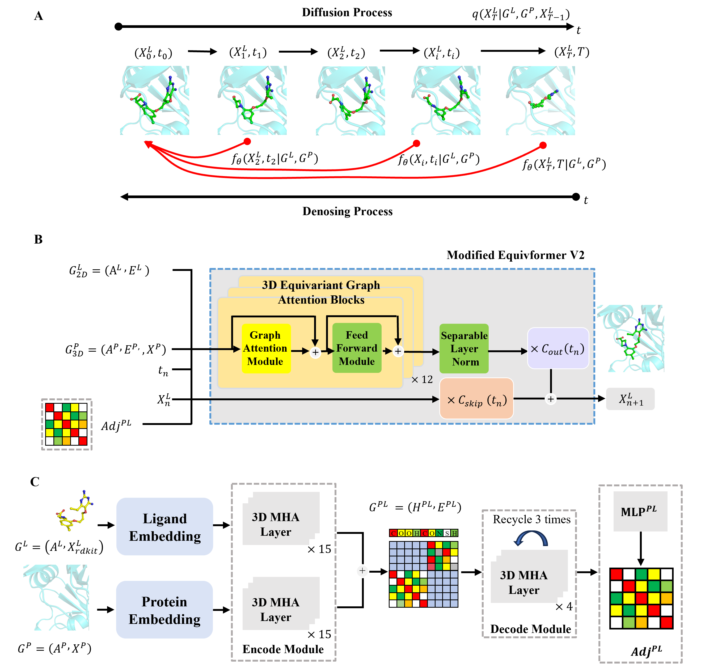

<h1 align="center">
   EC-Dock
</h1>

<h4 align="center">
EC-Dock: A Fast Equivariant Consistency Model for Molecular Docking and Virtual Screening
</h4>

<p align="center">
  
</p>

---

## Overview

EC-Dock is a fast molecular docking framework based on an equivariant consistency model. It is designed for efficient ligand pose generation and virtual screening by combining distance-guided protein--ligand interaction prediction with an equivariant generative docking model.

The overall workflow includes:

1. input preprocessing;
2. protein--ligand distance prediction;
3. docking pose generation;
4. force-field refinement;
5. final pose scoring.

---

## Usage

### Basic run

Run the full EC-Dock pipeline with an existing conda environment:

```bash
bash run_ecdock_pipeline.sh \
  --main_dir /mnt_191/zg_fan/new_Github-ECDock \
  --input_ligand /mnt_191/zg_fan/new_Github-ECDock/input_data/5SB2/5SB2_ligand.sdf \
  --input_protein /mnt_191/zg_fan/new_Github-ECDock/input_data/5SB2/5SB2_protein.pdb \
  --gpu 3 \
  --step 5 \
  --conf_num 5 \
  --env_name ecdock2
```

### Install environments and run

If you want to create the environment and run the pipeline in one command, add `--install`:

```bash
bash run_ecdock_pipeline.sh \
  --main_dir /mnt_191/zg_fan/new_Github-ECDock \
  --input_ligand /mnt_191/zg_fan/new_Github-ECDock/input_data/5SB2/5SB2_ligand.sdf \
  --input_protein /mnt_191/zg_fan/new_Github-ECDock/input_data/5SB2/5SB2_protein.pdb \
  --gpu 0 \
  --step 5 \
  --conf_num 5 \
  --install \
  --env_name ecdock2
```

---

## Common Options

| Option | Description | Default / Example |
|---|---|---|
| `--main_dir` | Project root directory | `/mnt_191/zg_fan/new_Github-ECDock` |
| `--input_ligand` | Input ligand SDF file | `input_data/5SB2/5SB2_ligand.sdf` |
| `--input_protein` | Input protein PDB file | `input_data/5SB2/5SB2_protein.pdb` |
| `--gpu` | GPU ID used for docking | `0` |
| `--env_name` | Conda environment name | `ecdock2` |
| `--step` | Number of sampling steps | `5` |
| `--conf_num` | Number of generated conformations | `5` |
| `--batch_size` | Docking batch size | `1` |
| `--start_idx` | Start index for processing | `0` |
| `--end_idx` | End index for distance-model inference | `100` |
| `--dock_end_idx` | End index for docking | `1000000000` |
| `--install` | Create the environment before running | disabled by default |
| `--keep_tmp` | Keep temporary directories after running | disabled by default |
| `--overwrite_output` | Overwrite existing output files | disabled by default |

---

## Temporary Directories

By default, the following temporary directories are removed after the pipeline finishes:

```text
tmpdata
tmpresault
user_data
```

To keep these directories for debugging, add:

```bash
--keep_tmp
```

---

## Output Location

The final output directory is automatically inferred from the input ligand path.

For example, if the input ligand is:

```text
/mnt_191/zg_fan/new_Github-ECDock/input_data/5SB2/5SB2_ligand.sdf
```

The final results will be copied to:

```text
/mnt_191/zg_fan/new_Github-ECDock/input_data/5SB2
```

---

## Citation

If you find EC-Dock useful in your research, please consider citing:

```bibtex
@article{fan2026ecdock,
  title   = {EC-Dock: A Fast Equivariant Consistency Model for Molecular Docking and Virtual Screening},
  author  = {Fan, Zhiguang and Yang, Yuedong and Xu, Mingyuan and Chen, Hongming},
  journal = {Journal of Chemical Information and Modeling},
  year    = {2026}
}
```

---

## Contact

For questions, issues, or suggestions, please open an issue on GitHub or contact the authors.